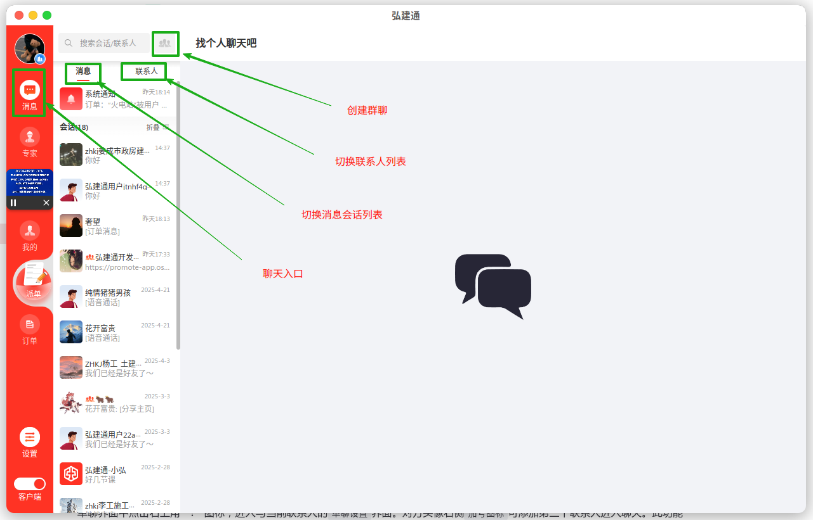

 本页面包含聊天功能的说明，如有需要点击对应标题即刻跳转到对应的操作说明。以电脑端界面进行演示，包括windows7、windows10、Mac。
 [[toc]]

## 聊天界面<Badge text="新" type="tip" />
聊天界面分为三部分，主区域为`聊天`会话区域，偏左侧的列表为会话列表，在会话列表上方为切换区域，可切换为`消息`或`通讯录`，顶部为搜索好友。右侧`加号`可打开二级菜单面板，包含功能：`新建群聊`。
在指定联系人会话条目中点击右键可呼出隐藏菜单，可进行`删除会话`。
点击指定用户会话可进入`聊天界面`。
 
### 单聊设置
单聊界面中点击右上角“ ::uil:ellipsis-h:: ”图标，进入与当前联系人的`单聊设置`界面。桌面端不支持通过单聊邀请第三人进入转化为群聊，请通过搜索栏右侧发起群聊创建。
底部为删除好友、设置备注按钮，删除操作需要进行`二次确认`，请谨慎选择是否删除，删除后对方将从您的联系人列表移除。

>[!tip]
> *临时会话点击进入`单聊设置`时，功能选项有所不同，不支持设置备注【如需设置备注，请先添加好友】，仅显示拉黑、举报，底部删除好友按钮会显示为添加好友。*

 

### 群聊管理
消息列表中带 ::uil:users-alt:: 图标的条目为`群聊`消息，全部群聊的管理入口位于`通讯录`界面`我的好友`分组下方。支持修改`头像`，`群聊名称`，`描述`，以及设置`是否允许其他人邀请进群`。修改后需要手动点击`确认修改`保存。

  

## 联系人界面<Badge text="新" type="tip" />
通讯录界面也叫联系人界面，右上角加号可打开二级菜单，包含功能：`新建群聊`。
- 联系人列表第一个为`添加好友`，可搜索非好友用户，添加为好友。【支持弘建通号、昵称搜索】
- 下方为`新的朋友`为好友申请入口。新的好友申请会显示在新的好友里面。
- 下方为`文件传输助手`。可与已登录的其他设备进行互传文件。
- 再往下为`我的好友`分组。
- 最下方为`我加入的群聊`分组。可查看并进入所有已加入或创建、管理的群聊。

 

