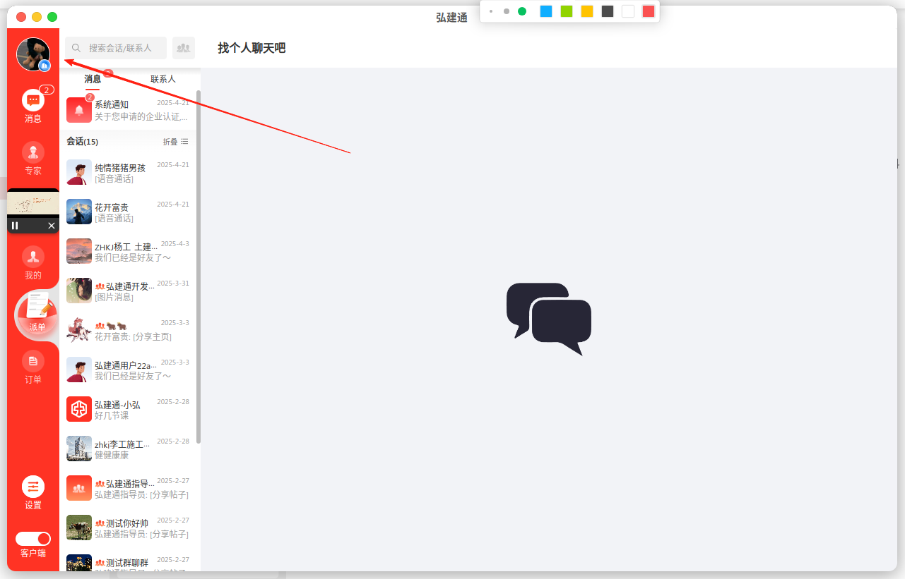
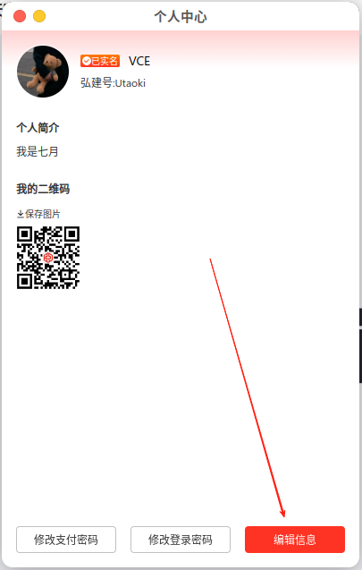
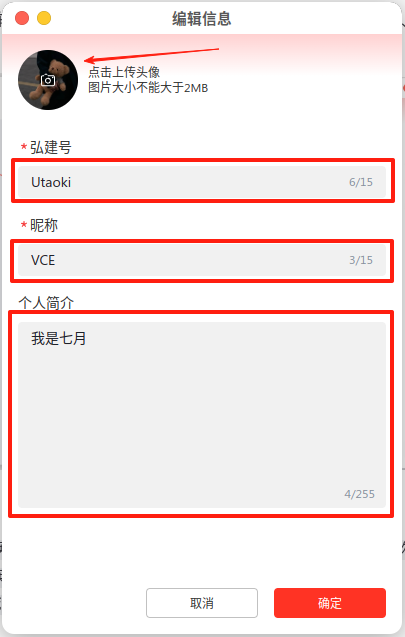

 本页面包含以下操作的说明，如有需要点击对应标题即刻跳转到对应的操作说明。以电脑端界面进行演示，包括Windows7、Windows10、Mac。
 [[toc]]

## 修改个人资料<Badge text="新" type="tip" />

点击以下图中标记区域可进入编辑资料页面。支持修改字段：弘建通号、用户昵称、地址、简介、头像。以下将对各字段填写及修改要求做明确说明：

  

**填写要求：**

- **弘建通号：** `长度5-15位，支持英文数字，需要以英文字母开头（与微信号相同概念，如不理解请勿修改，保持默认即可）`
- **用户昵称：** `长度15位，支持中英文数字符号，但建议不要使用特殊符号以及@#￥%等字符符号`
- **地址：** `仅支持选择中国大陆区域`*该信息仅支持手机端修改，电脑端不支持。*
- **简介：** `长度限制255位`
- **头像：** `支持jpg,jpeg,png,heic,等常见图片格式，头像暂不支持上传前裁剪` 该功能请等待后续版本迭代

## 实名认证<Badge text="新" type="tip" />

在修改个人资料界面中，标记区域是实名认证状态，在未认证状态下显示为**未实名**，点击未实名图标即可进入实名界面，`实名认证`和`企业认证`非强关联，可全部认证也可以选择其一进行认证。但需注意，使用营收钱包提现时会校验是否进行了实名认证，未进行实名认证的账户不管是个人还是企业均无法提现。
> [!tip]
>  - 为保证主体信息统一，个人实名认证后不支持修改认证主体，请确认要认证的个人主体身份证及银行卡信息是否属于本人，且一致。
>  - 请确保身份证信息有效真实，及图片文字清晰可见、不反光，否则可能导致认证核验失败。

 

## 企业认证<badge text="新" type="tip"/>
企业认证入口位于下图标记区域中显示`企业认证`的栏目，企业认证后可上架`企业资质`和`企业产品`进行`推广`，其他博主可在自己视频上`下挂产品链接`进行推广。
填写企业资质后确认提交等待后台审核通过后即可成为企业认证用户。
- **企业名称：** 必填 长度为3-50个字符，如您的企业名称超过50个字符请与我们联系。
- **企业简介：** 长度5-1000个字符。
- **授权委托书：** 必传 需下载盖企业章后上传。
- **资质证书/荣誉：** 非必传，如果您的企业有相关证书或荣誉，建议上传增强公司权威性，会带来意想不到的效果和业务。

>[!tip]
> **`营业执照`为`必传`，且需要与上面填写的`企业名称`一致。*营业执照图片需要保证文字内容`清晰可见`，`不反光`。不符合条件的图片存在被`机器审核驳回`的风险***

   

## 邀请注册<badge text="新" type="tip"/>
本平台支持`邀请好友赚取佣金`，被邀请人通过您的`专属邀请码`或`专属邀请地址`注册后， 每`支付一单`或每`完成一单`，您都可以获得`20元现金奖励`，奖励将在被邀请人订单完结后直接发放到营收钱包，`实名认证`后可`直接提现`，无其他`门槛`，上不封顶。
> [!tip]
> *图二为被邀请人通过`邀请码`或`邀请地址`访问后看到的界面演示。只有通过`链接访问`该地址才会绑定邀请关系，该关系仅可在注册时绑定，`注册`后`无法绑定`。*

  

