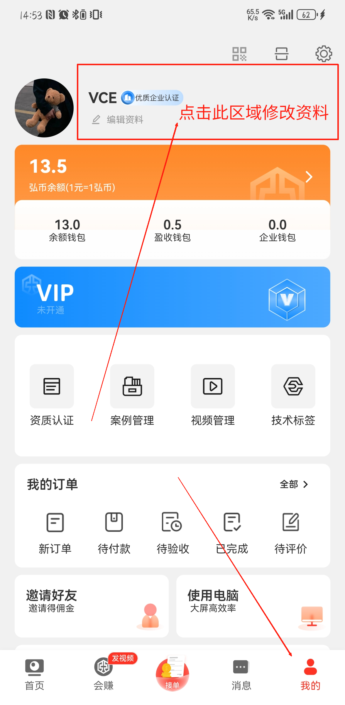
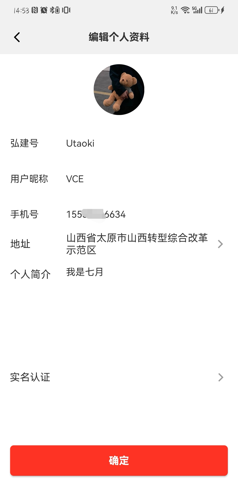
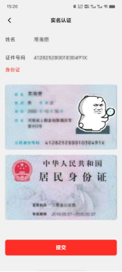

 本页面包含以下操作的说明，如有需要点击对应标题即刻跳转到对应的操作说明。
 [[toc]]
## 修改个人资料<Badge text="新" type="tip" />

点击以下图中标记区域可进入编辑资料页面。支持修改字段：弘建通号、用户昵称、地址、简介、头像。以下将对各字段填写及修改要求做明确说明：

 

**填写要求：**

- 弘建通号： `长度5-15位，支持英文数字，需要以英文字母开头（与微信号相同概念，如不理解请勿修改，保持默认即可）`
- 用户昵称：`长度15位，支持中英文数字符号，但建议不要使用特殊符号以及@#￥%等字符符号`
- 地址：`仅支持选择中国大陆区域`
- 简介：`长度限制255位`
- 头像：`支持jpg,jpeg,png,heic,等常见图片格式，头像暂不支持上传前裁剪` 该功能请等待后续版本迭代

## 实名认证<Badge text="新" type="tip" />

在修改个人资料界面中，标记区域是实名认证，`实名认证`和`企业认证`非强关联，可全部认证也可以选择其一进行认证。
> [!tip]
>  - 为保证主体信息统一，个人实名认证后不支持修改认证主体，请确认要认证的个人主体身份证及银行卡信息是否属于本人，且一致。
>  - 请确保身份证信息有效真实，及图片文字清晰可见、不反光，否则可能导致认证核验失败。

 

## 钱包<Badge text="新" type="tip" />
钱包分为`个人钱包`、`盈收钱包`、`企业钱包`。三个钱包使用场景及作用范围存在差异，为方便用户使用，以下将对各个钱包的作用及使用范围做具体解释。
+ **个人钱包**：推荐个人用户（具备`相关专业职业技能`且`已满18周岁`的、具有`承担民事责任`的`自由职业者`）优先使用，如您是个体户，推荐使用企业钱包。
+ **营收钱包**：
+ **企业钱包**：如您是`企业用户`（包括个体户），推荐优先使用企业钱包，企业钱包消费可在线`开具发票`，但充值金额`不可提现`，`仅可消费`，请与企业相关人员确认业务后再进行充值。

