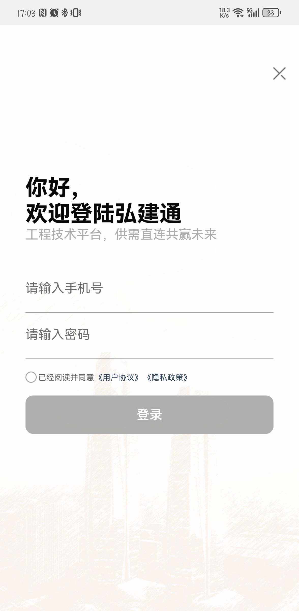
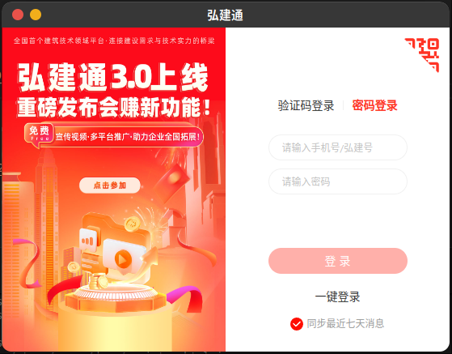
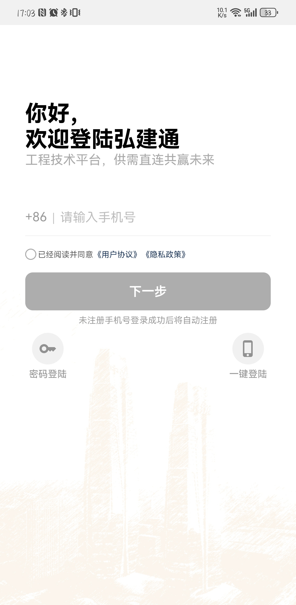
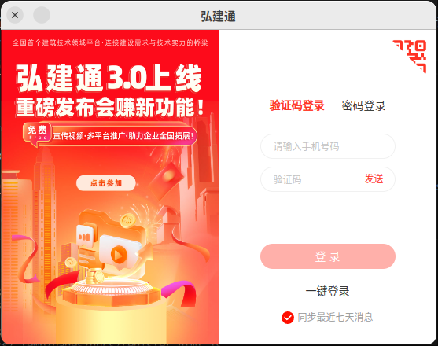
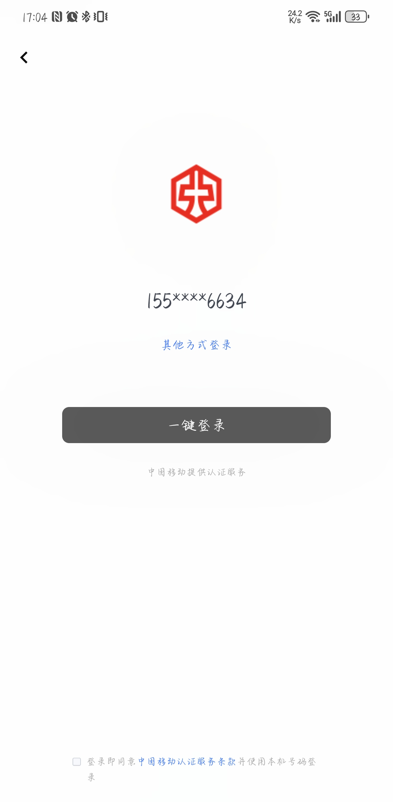
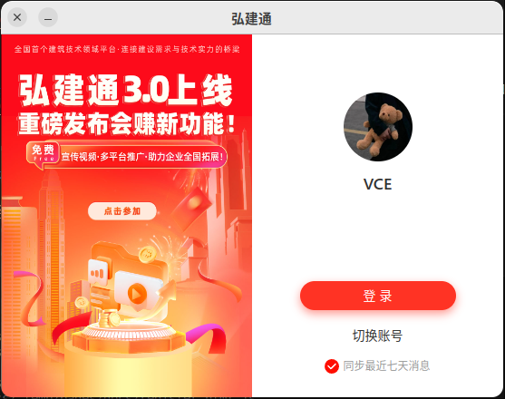
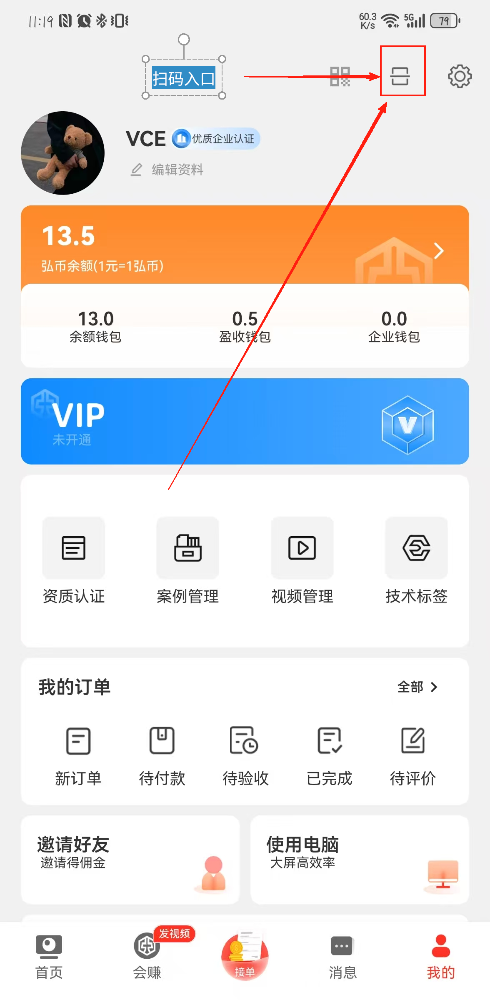
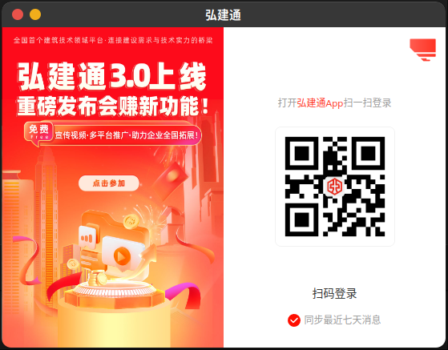

本页面提供注册及登录教程，以及注册登录时需要注意的事项。和各类设备支持的登录方式。本页面包含以下操作的说明，如有需要点击对应标题即刻跳转到对应的操作说明。
 
 [[toc]]
## 注册 
本平台不提供`无单独注册`功能。注册方式为`手机号`登录，若手机号未在本平台注册，会在登录时进行自动注册并完成登录。如果是本平台用户，将进行直接登录。
:::important 手机号未限制国家区域，但限制长度为`11`位，注册、登录时将校验格式是否为`中国大陆`手机号格式。其他国家地域号码如果和国内保持一致，并且能正常收到验证码，理论上可以进行正常使用(`国外手机号未进行官方支持`)
:::
::: note
如出现`无法收到验证码`的情况，请检查所在位置的`网络信号状态`，如确认网络信号稳定可用，可能是`运营商网络拥堵`，为正常情况，请稍候尝试，如超过24小时依然无法获取验证码请与我们联系反馈，我们将提供技术人员进行排查。避免频繁获取验证码，频次过高会触发运营商限流机制，被短期拉黑（`第二天自动恢复正常`）。
:::

## 邀请注册<Badge text="新" type="tip" />
被邀请人 每`支付一单`或每`完成一单`，您都可以获得`20元现金奖励`，奖励将在被邀请人订单完结后发放到`营收钱包`，`实名认证`后可`直接提现`，无其他`门槛`，上不封顶。
>[!tip]
> 邀请注册相关请点击以下链接跳转至 *`邀请注册赚取佣金`*：
> [*邀请好友注册赚取佣金（点击这里）*](./my#邀请注册)

## 登录 
平台提供四种登录方式：`密码登录`，`验证码登录`，`一键登录`，`扫码登录（仅限桌面端）`。鸿蒙next设备咱不支持使用一键登录，如需使用此功能，请关注后续升级计划。
### 登录方式明细
密码登录仅限于平台已经注册过的用户，新用户无法使用。

验证码登录为通用推荐登录方式:支持`桌面端`、`小程序`、`手机端（包括鸿蒙系统）`

| 登录方式\设备 |  安卓端   | iOS端  | 鸿蒙端 | 桌面端PC | 小程序 |
|  ----  | ----  | ----  | ----  | ----  | ----  |
| 密码登录  | ✅ | ✅ | ✅ | ✅ | ❌ |
| 验证码登录  | ✅ | ✅ | ✅ | ✅| ✅ |
| 一键登录 | ✅ | ✅ | ✅ | ✅ | ✅ |
| 扫码登录 | ❌ | ❌ | ❌ | ❌ | ✅ | 

### 密码登录
手机端 、桌面端均支持密码登录。手机号限制`11位`，需要符合手机号格式，密码限制长度`255位`。

        

### 验证码登录
手机端、桌面端、小程序均支持验证码登录。受运营商网络影响，在运营商网络波动或拥堵时，可能存在极小概率无法收到验证码的情况
::: tip
如出现`无法收到验证码`的情况，请检查所在位置的`网络信号状态`，如确认网络信号稳定可用，可能是`运营商网络拥堵`，为正常情况，请稍候尝试，如超过24小时依然无法获取验证码请与我们联系反馈，我们将提供技术人员进行排查。避免频繁获取验证码，频次过高会触发运营商限流机制，被短期拉黑（`第二天自动恢复正常`）。
:::
  

### 一键登录
桌面端一键登录需要在登录过的状态下进行一键登录。安卓IOS端一键登录无需登录过，仅需要保证所在位置网络良好，如手机端显示一键登录失败，请`关闭WIFI`后重试。
> [!tip]
> - 鸿蒙next端暂不支持一键登录（Harmony NEXT 5.0以上），鸿蒙端EMUI8-EMUI11，Harmony2.0-Harmony4.2全部型号均支持
> - 一键登录对网络质量要求极高，请确保网络质量良好

  

### 扫码登录

扫码登录目前只支持桌面端，其他端均不支持。手机端扫码入口位于我的页面，右上角`扫码`按钮

